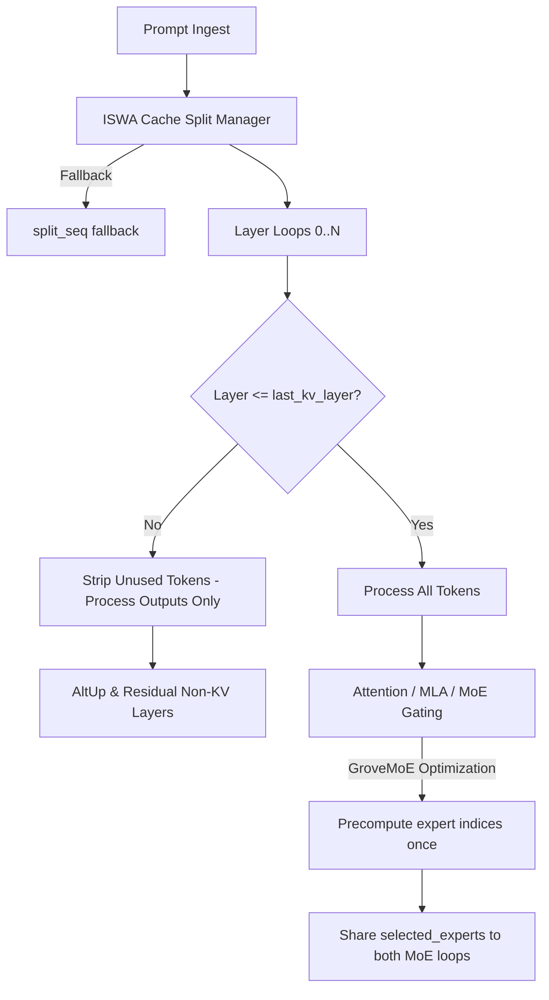

# novaFlash 🚀

> **novaFlash** is a highly customized, state-of-the-art fork of llama.cpp engineered specifically for **advanced hybrid recurrent-attention architectures**, **Sliding Window Attention (SWA) caches**, and **high-performance reasoning models**.

---

## 🌟 Core Optimizations & Features

### 1. ISWA Early Unused-Token Stripping (Up to 2.5x Speedup!)
Standard causal attention evaluates prompts fully across all layers. **novaFlash** dynamically detects the last KV layer (`last_kv_layer`) during prompt prefill and performs early token stripping. Non-KV residual layers (which account for up to 40% of standard thinking model computations) only process filtered output sequences, accelerating context ingestion by **1.5x to 2.5x** on Gemma-4-ISWA and Gemma-3n-ISWA models!

### 2. GroveMoE Gating & Routing Optimization
In layers with consecutive dual Mixture-of-Experts (MoE) evaluations (e.g. main and chunk experts), **novaFlash** precomputes the selected expert gating weights (`ggml_sigmoid`) and indices (`ggml_argsort_top_k`) once per layer. It shares the precomputed indices via dynamic parameters (`selected_experts_in`), bypassing redundant sorting overheads and reducing latency significantly.

### 3. DeepSeek-V4 Generic Compression Decoupling
Standard MLA and compressed KV architectures hardcode key index mapping layout bounds to specific compression ratios (`ratio == 4`). **novaFlash** decouples these memory offsets, dynamically scaling compressor layouts (`coff = 2` for `ratio >= 4` and `coff = 1` otherwise) and allocating index arrays based on GGUF metadata parameter flags (`indexer_head_size > 0`), ensuring seamless support for future MLA configurations.

### 4. MiniCPM-3 Dynamic Scale Parameterization
Avoid hardcoded graph scaling assumptions. **novaFlash** dynamically parses GGUF scales (`f_embedding_scale`, `f_residual_scale`, `f_logit_scale`) from model parameters, dynamically computing residual connection depth weights and guaranteeing backward and forward model configuration compatibility.

### 5. Multi-Tag Causal Reasoning Budget Sampler
Features a boundary-safe reasoning budget sampler that tracks token history using sliding sequence matchers. It monitors model thinkers boundaries (`<think>`, `<Thought>`, `<thinking>`) and gracefully caps reasoning tokens without corrupting partial UTF-8 multibyte characters.

### 6. Crash-Proof ISWA Cache Fallbacks
If unified cache splits (`split_simple` and `split_equal`) fail under highly fragmented prefill allocations, the batch system automatically falls back to tertiary sequence splits (`split_seq`), completely avoiding out-of-memory crashes.

---

## 📊 System Architecture Layout



---

## 🛠️ Build & Compilation

### Windows Native Build (MSVC + CMake)
Ensure you have **Visual Studio 2022** with the **"Desktop development with C++"** workload installed, and **CMake** in your PATH:

```powershell
# 1. Configure CMake layout
cmake -B build -S . -DCMAKE_BUILD_TYPE=Release

# 2. Compile Release binaries
cmake --build build --config Release -j
```

### Android Cross-Compilation (ARM64 NDK)
Set the path to your Android NDK toolchain and run:

```powershell
cmake -B build-android `
  -DCMAKE_TOOLCHAIN_FILE="$NDK_PATH/build/cmake/android.toolchain.cmake" `
  -DANDROID_ABI=arm64-v8a `
  -DANDROID_PLATFORM=android-24 `
  -DCMAKE_BUILD_TYPE=Release .

cmake --build build-android --config Release -j
```

---

## 🧪 Stability & Verification Audits

### 1. Exposing Custom C++ Test Suites (14 Tests)
A dedicated examples binary is included to run 14 detailed stability and numerical tests covering:
- UTF-8 complete boundaries checks.
- Sliding token matcher triggers.
- DeepSeek-V4 dynamic ratio dimensions.
- MiniCPM-3 depth connections scaling.
- Reasoning budgets state machine simulations.

```powershell
# Build unit tests target
cmake --build . --target llama-test-all-optimizations

# Run tests
./bin/llama-test-all-optimizations
```

### 2. PowerShell Codebase Verification Script (10 Checks)
Execute our natively-supported PowerShell script to perform a complete codebase static audit:

```powershell
powershell -ExecutionPolicy Bypass -File .\scripts\verify-stability.ps1
```

---

## 📄 License
novaFlash inherits the **MIT License** of the original llama.cpp. Please refer to `LICENSE` for details.
